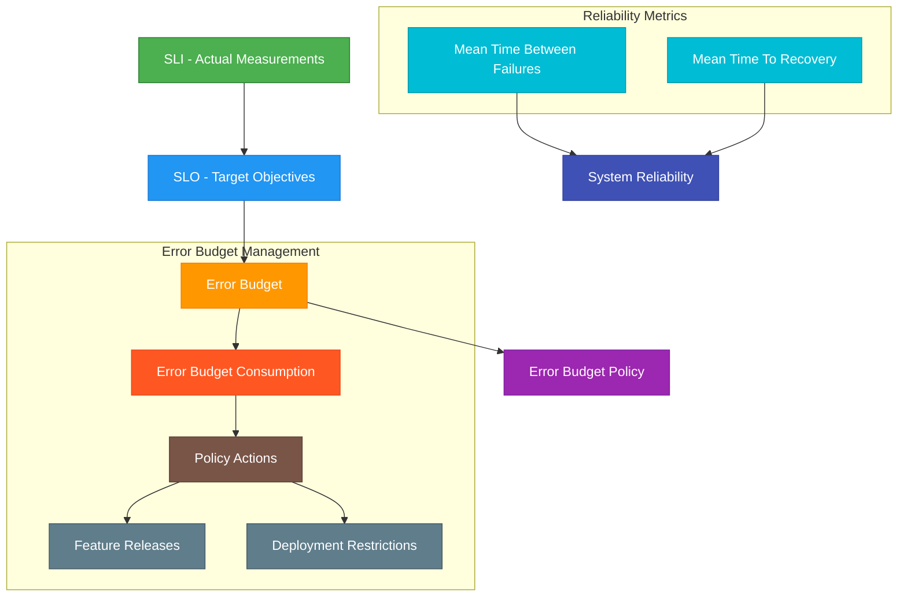
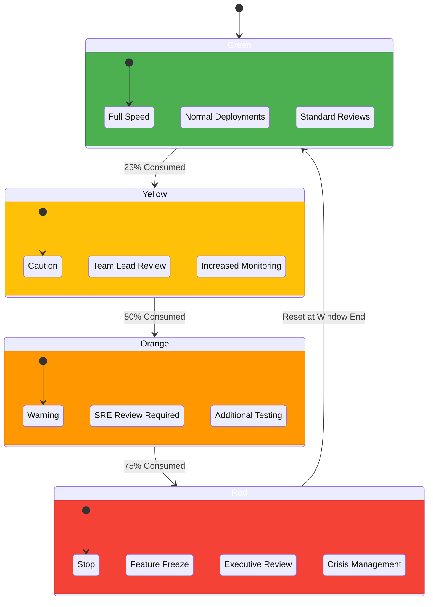
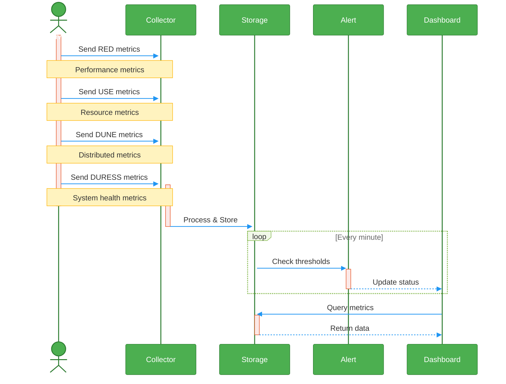
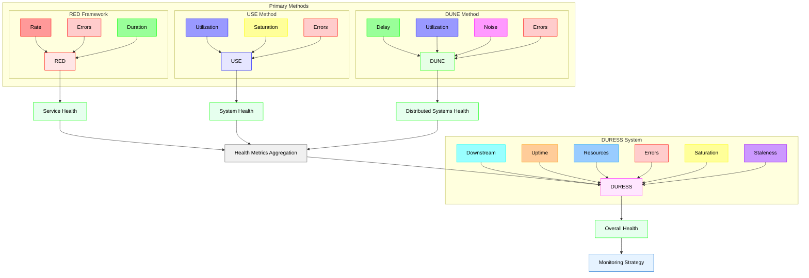

# SRE Metrics Implementation Guide

## 1. Service Level Objectives ([SLO])

### Definition
An [SLO] is a target value or range for a service level that you want to achieve over a specified time window.

### Implementation Steps
1. [ ] Identify critical user journeys
2. [ ] Define what "good service" means for each journey
3. [ ] Choose appropriate metrics to measure
4. [ ] Set realistic targets based on historical data
5. [ ] Define measurement windows (e.g., 28 days rolling)
6. [ ] Get stakeholder agreement
7. [ ] Document and communicate

### Example Targets
- Availability: 99.9% uptime
- Latency: 95% of requests < 200ms
- Error rate: < 0.1% of requests
- Durability: 99.999999% data retention

### Calculator
```python
def calculate_slo_compliance(total_events, successful_events):
    """
    Calculate SLO compliance percentage
    
    Parameters:
    total_events (int): Total number of events/requests
    successful_events (int): Number of successful events/requests
    
    Returns:
    float: SLO compliance percentage
    """
    if total_events == 0:
        return 0.0
    
    compliance = (successful_events / total_events) * 100
    return round(compliance, 3)

def is_meeting_slo(current_compliance, slo_target):
    """
    Check if current compliance meets SLO target
    
    Parameters:
    current_compliance (float): Current compliance percentage
    slo_target (float): SLO target percentage
    
    Returns:
    bool: True if meeting SLO, False otherwise
    """
    return current_compliance >= slo_target
```

## 2. Service Level Indicators ([SLI])

### Definition
SLIs are the actual measurements of service behavior that you use to determine if you're meeting SLOs.

### Implementation Steps
1. [ ] Choose what to measure:
   - Request latency
   - Error rate
   - System throughput
   - Availability
2. [ ] Define measurement points
3. [ ] Set up monitoring
4. [ ] Implement collection methods
5. [ ] Create dashboards
6. [ ] Set up alerts

### Common SLIs
- Availability = successful requests / total requests
- Latency = time to serve request
- Quality = successful executions / total executions
- Freshness = time since last update
- Coverage = percentage of data processed

### Calculator
```python
def calculate_sli(good_events, total_events, sli_type="availability"):
    """
    Calculate SLI for different metrics
    
    Parameters:
    good_events (int/float): Number of good events or measurements
    total_events (int/float): Total number of events
    sli_type (str): Type of SLI (availability, latency, quality)
    
    Returns:
    float: SLI value
    """
    if total_events == 0:
        return 0.0
        
    sli = (good_events / total_events) * 100
    
    # Add specific handling for different SLI types
    if sli_type == "latency":
        # For latency, we might want to use percentiles instead
        sli = calculate_percentile(good_events, 95)  # 95th percentile
        
    return round(sli, 3)
```

## 3. Error Budget

### Definition
The error budget is the allowed threshold for errors or unavailability within your [SLO] period.

### Implementation Steps
1. [ ] Define SLO target
2. [ ] Calculate available error budget
3. [ ] Set up tracking
4. [ ] Define consumption rules
5. [ ] Create alerts for consumption
6. [ ] Document policy actions

### Calculator
```python
def calculate_error_budget(slo_target, measurement_period_hours=720):  # 30 days
    """
    Calculate error budget for a given SLO target
    
    Parameters:
    slo_target (float): SLO target percentage (e.g., 99.9)
    measurement_period_hours (int): Hours in measurement period
    
    Returns:
    dict: Error budget in different units
    """
    total_minutes = measurement_period_hours * 60
    allowed_downtime_minutes = total_minutes * ((100 - slo_target) / 100)
    
    return {
        'minutes': round(allowed_downtime_minutes, 2),
        'hours': round(allowed_downtime_minutes / 60, 2),
        'percentage': round(100 - slo_target, 3)
    }

def calculate_error_budget_remaining(slo_target, current_availability, 
                                  measurement_period_hours=720):
    """
    Calculate remaining error budget
    
    Parameters:
    slo_target (float): SLO target percentage
    current_availability (float): Current availability percentage
    measurement_period_hours (int): Hours in measurement period
    
    Returns:
    dict: Remaining error budget in different units
    """
    total_budget = calculate_error_budget(slo_target, measurement_period_hours)
    consumed_minutes = measurement_period_hours * 60 * \
                      ((slo_target - current_availability) / 100)
    
    remaining_minutes = total_budget['minutes'] - consumed_minutes
    
    return {
        'minutes': round(remaining_minutes, 2),
        'hours': round(remaining_minutes / 60, 2),
        'percentage': round((remaining_minutes / (measurement_period_hours * 60)) * 100, 3)
    }
```

## 4. Mean Time To Recovery ([MTTR])

### Definition
[MTTR] measures the average time taken to recover from a failure.

### Implementation Steps
1. [ ] Define what constitutes an incident
2. [ ] Define start and end points of recovery
3. [ ] Set up incident tracking
4. [ ] Implement measurement tools
5. [ ] Create recovery time dashboards
6. [ ] Set targets for improvement

### Calculator
```python
def calculate_mttr(downtimes):
    """
    Calculate Mean Time To Recovery
    
    Parameters:
    downtimes (list): List of downtime durations in minutes
    
    Returns:
    float: MTTR in minutes
    """
    if not downtimes:
        return 0.0
    
    mttr = sum(downtimes) / len(downtimes)
    return round(mttr, 2)

def analyze_mttr_trends(monthly_downtimes):
    """
    Analyze MTTR trends over time
    
    Parameters:
    monthly_downtimes (dict): Dictionary of month: [downtimes]
    
    Returns:
    dict: Monthly MTTR values and trend analysis
    """
    monthly_mttrs = {}
    for month, downtimes in monthly_downtimes.items():
        monthly_mttrs[month] = calculate_mttr(downtimes)
    
    trend = 'improving' if list(monthly_mttrs.values())[-1] < list(monthly_mttrs.values())[0] else 'degrading'
    
    return {
        'monthly_values': monthly_mttrs,
        'trend': trend,
        'average': round(sum(monthly_mttrs.values()) / len(monthly_mttrs), 2)
    }
```

## 5. Mean Time Between Failures ([MTBF])

### Definition
[MTBF] measures the average time between system failures.

### Implementation Steps
1. [ ] Define what constitutes a failure
2. [ ] Set up failure detection
3. [ ] Implement tracking system
4. [ ] Create measurement periods
5. [ ] Set up trending
6. [ ] Define improvement targets

### Calculator
```python
def calculate_mtbf(total_time, number_of_failures):
    """
    Calculate Mean Time Between Failures
    
    Parameters:
    total_time (float): Total operational time in hours
    number_of_failures (int): Number of failures in that period
    
    Returns:
    float: MTBF in hours
    """
    if number_of_failures == 0:
        return total_time
    
    mtbf = total_time / number_of_failures
    return round(mtbf, 2)

def calculate_reliability(mtbf, mttr):
    """
    Calculate system reliability using MTBF and MTTR
    
    Parameters:
    mtbf (float): Mean Time Between Failures in hours
    mttr (float): Mean Time To Recovery in hours
    
    Returns:
    float: Reliability as a percentage
    """
    reliability = (mtbf / (mtbf + mttr)) * 100
    return round(reliability, 3)
```

## 6. Error Budget Policy

### Definition
A policy that defines what actions to take when error budget is consumed.

### Implementation Steps
1. [ ] Define stakeholders
2. [ ] Set consumption thresholds
3. [ ] Define actions at each threshold
4. [ ] Create escalation paths
5. [ ] Document consequences
6. [ ] Get agreement from all parties
7. [ ] Set review periods

### Policy Template Structure
```python
class ErrorBudgetPolicy:
    def __init__(self, slo_target, measurement_period_days=30):
        self.slo_target = slo_target
        self.measurement_period = measurement_period_days
        self.thresholds = {
            'green': 100,
            'yellow': 75,
            'orange': 50,
            'red': 25
        }
        
    def get_policy_actions(self, error_budget_remaining):
        """
        Get policy actions based on remaining error budget
        
        Parameters:
        error_budget_remaining (float): Percentage of error budget remaining
        
        Returns:
        dict: Required actions and restrictions
        """
        actions = {
            'deployment_allowed': True,
            'required_reviews': [],
            'restrictions': [],
            'notifications': []
        }
        
        if error_budget_remaining <= self.thresholds['red']:
            actions['deployment_allowed'] = False
            actions['required_reviews'].append('Executive Review')
            actions['restrictions'].append('Feature Freeze')
            actions['notifications'].append('Executive Team')
            
        elif error_budget_remaining <= self.thresholds['orange']:
            actions['required_reviews'].append('SRE Review')
            actions['restrictions'].append('Increased Testing Required')
            actions['notifications'].append('Engineering Leadership')
            
        elif error_budget_remaining <= self.thresholds['yellow']:
            actions['required_reviews'].append('Team Lead Review')
            actions['notifications'].append('Team Lead')
            
        return actions
```

### Example Policy Implementation
```python
def implement_error_budget_policy(current_availability, slo_target):
    """
    Implement error budget policy
    
    Parameters:
    current_availability (float): Current service availability
    slo_target (float): SLO target
    
    Returns:
    dict: Policy actions to take
    """
    policy = ErrorBudgetPolicy(slo_target)
    
    # Calculate remaining error budget
    budget_remaining = calculate_error_budget_remaining(
        slo_target, 
        current_availability
    )
    
    # Get policy actions
    actions = policy.get_policy_actions(
        budget_remaining['percentage']
    )
    
    return {
        'budget_remaining': budget_remaining,
        'policy_actions': actions,
        'status': get_status_level(budget_remaining['percentage'])
    }
```


<hr>
<br>

## [SLO] Component Relationship



<br>

## State Change Diagram



<br>  
<hr>  
<br>  


# SRE Observability Frameworks Guide

THere are many frameworks to choose from. Each framework serves different but complementary purposes. Common examples are:

[RED]: Service behavior  
[USE]: Resource utilization  
[DUNE]: Distributed systems  
[DURESS]: Overall service health  
[CELTE]: Customer experience  

## 1. `RED` Method
### Definition
[RED] is a microservices-oriented monitoring framework focused on core service behavior (mentioned in [4 Signals]).

### Components
- **Rate (R)**: Number of requests per second
- **Errors (E)**: Number of failed requests per second
- **Duration (D)**: Distribution of request latencies

### Example Implementation Steps
1. [ ] Set up request rate monitoring
   ```python
   def calculate_request_rate(total_requests, time_period_seconds):
       """
       Calculate requests per second
       """
       return round(total_requests / time_period_seconds, 2)
   ```

2. [ ] Implement error tracking
   ```python
   def calculate_error_rate(total_requests, failed_requests):
       """
       Calculate error rate percentage
       """
       if total_requests == 0:
           return 0
       return round((failed_requests / total_requests) * 100, 2)
   ```

3. [ ] Measure request duration
   ```python
   def analyze_latency_distribution(durations):
       """
       Calculate latency percentiles
       """
       return {
           'p50': numpy.percentile(durations, 50),
           'p90': numpy.percentile(durations, 90),
           'p99': numpy.percentile(durations, 99)
       }
   ```

## 2. `USE` Method
### Definition
[USE] focuses on performance and resource utilization analysis.

### Components
- **Utilization (U)**: Percentage of time resource is busy
- **Saturation (S)**: Degree to which resource has extra work
- **Errors (E)**: Count of error events

### Implementation Steps
1. [ ] Monitor resource utilization
   ```python
   def calculate_utilization(busy_time, total_time):
       """
       Calculate resource utilization percentage
       """
       return round((busy_time / total_time) * 100, 2)
   ```

2. [ ] Track saturation
   ```python
   def calculate_saturation(queue_length, max_queue):
       """
       Calculate resource saturation level
       """
       return round((queue_length / max_queue) * 100, 2)
   ```

3. [ ] Error counting
   ```python
   def track_resource_errors(error_types):
       """
       Track errors by type and frequency
       """
       return {
           error_type: count 
           for error_type, count in Counter(error_types).items()
       }
   ```

## 3. `DUNE` Method
### Definition
[DUNE] is focused on distributed systems monitoring.

### Components
- **Delay (D)**: Time taken for operations
- **Utilization (U)**: Resource usage levels
- **Noise (N)**: System interference/crosstalk
- **Errors (E)**: Failure counts and types

### Implementation
```python
class DUNEMetrics:
    def calculate_delay(self, operation_times):
        """Calculate operation delays"""
        return {
            'avg': statistics.mean(operation_times),
            'max': max(operation_times),
            'min': min(operation_times)
        }
    
    def measure_noise(self, baseline, current):
        """Measure system interference"""
        return {
            'deviation': abs(current - baseline),
            'percentage': (abs(current - baseline) / baseline) * 100
        }
```

## 4. `DURESS` Method
### Definition
[DURESS] is focused on overall service health and how it relates to user experience.

### Components
- **Downstream (D)**: Dependency health
- **Uptime (U)**: Service availability
- **Resource (R)**: Resource usage
- **Error (E)**: Error patterns
- **Saturation (S)**: System load
- **Staleness (S)**: Data freshness

### Implementation
```python
class DURESSMonitor:
    def check_dependencies(self, dependencies):
        return {
            dep: {
                'status': status,
                'latency': latency,
                'errors': error_count
            }
            for dep, (status, latency, error_count) in dependencies.items()
        }
    
    def measure_staleness(self, last_update_time):
        """Calculate data staleness"""
        current_time = time.time()
        return current_time - last_update_time
```

## 5. `CELTE` Method
### Definition
[CELTE] focuses more on customer experience and business facing metrics.

### Components
- **Customer (C)**: User experience metrics
- **Error (E)**: Service errors
- **Latency (L)**: Response times
- **Traffic (T)**: Request volumes
- **Exhaustion (E)**: Resource limits

### Implementation
```python
def calculate_celte_score(metrics):
    """
    Calculate overall service health score
    """
    weights = {
        'customer_satisfaction': 0.3,
        'error_rate': 0.2,
        'latency_score': 0.2,
        'traffic_health': 0.15,
        'resource_health': 0.15
    }
    
    return sum(metric * weights[name] 
              for name, metric in metrics.items())
```

## Information flows by framework



<br>


## Relationship between frameworks



[Frameworks]: https://alertstack.io/frameworks

[Observability Frameworks]: https://alertstack.io/frameworks

[SLO]: https://sre.google/sre-book/service-level-objectives/

[SLI]: https://www.sumologic.com/glossary/sli-service-level-indicator/

[SLA]: https://sre.google/sre-book/service-level-objectives/

[MTTR]: https://www.blameless.com/blog/mttr

[MTBF]: https://www.blameless.com/blog/mttr

[MTTA]: https://www.blameless.com/blog/mttr

[MTTR]: https://www.blameless.com/blog/mttr

[RED]: https://www.splunk.com/en_us/blog/learn/red-monitoring.html

[DURESS]: https://sre.google/sre-book/service-level-objectives/

[DUNE]: https://sre.google/sre-book/service-level-objectives/

[USE]: https://sre.google/sre-book/service-level-objectives/

[CELTE]: https://sre.google/sre-book/service-level-objectives/

[4 Signals]: https://sre.google/sre-book/monitoring-distributed-systems/#xref_monitoring_golden-signals

[Error Budget Policy]: https://sre.google/workbook/error-budget-policy

[SLO Document]: https://sre.google/workbook/slo-document/

