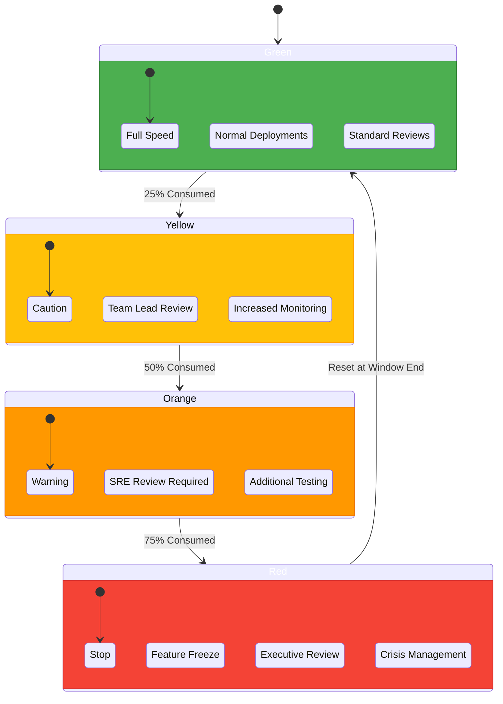

## [SLO] State Change Diagram

[Frameworks]: https://alertstack.io/frameworks

[Observability Frameworks]: https://alertstack.io/frameworks

[SLO]: https://sre.google/sre-book/service-level-objectives/

[SLI]: https://www.sumologic.com/glossary/sli-service-level-indicator/

[SLA]: https://sre.google/sre-book/service-level-objectives/

[MTTR]: https://www.blameless.com/blog/mttr

[MTBF]: https://www.blameless.com/blog/mttr

[MTTA]: https://www.blameless.com/blog/mttr

[MTTR]: https://www.blameless.com/blog/mttr

[RED]: https://www.splunk.com/en_us/blog/learn/red-monitoring.html

[DURESS]: https://sre.google/sre-book/service-level-objectives/

[DUNE]: https://sre.google/sre-book/service-level-objectives/

[USE]: https://sre.google/sre-book/service-level-objectives/

[CELTE]: https://sre.google/sre-book/service-level-objectives/

[4 Signals]: https://sre.google/sre-book/monitoring-distributed-systems/#xref_monitoring_golden-signals

[Error Budget Policy]: https://sre.google/workbook/error-budget-policy

[SLO Document]: https://sre.google/workbook/slo-document/

[Error Budget]: https://handbook.gitlab.com/handbook/engineering/error-budgets/