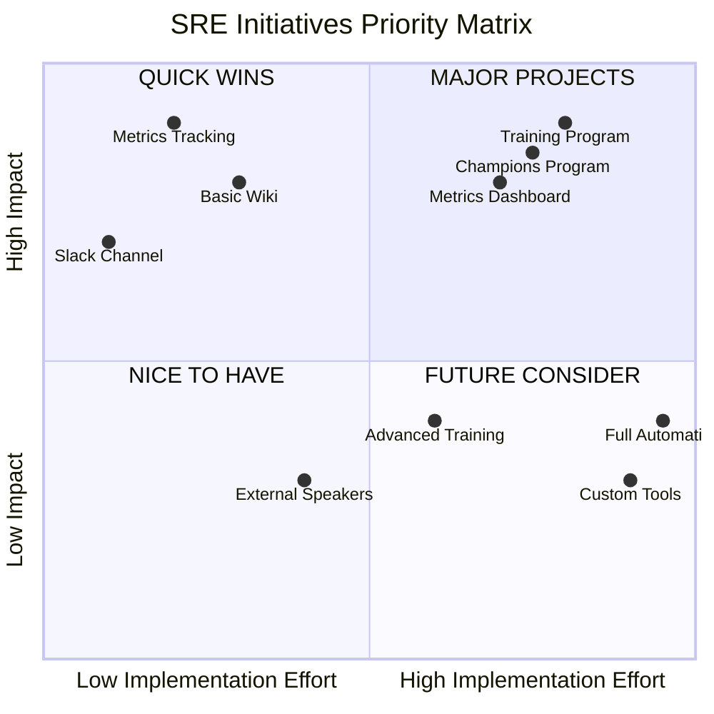

# SRE Value Prop Implementation Strategy

## Priority Levels
- **P0**: Critical foundation - Start immediately (Week 1-4)
- **P1**: High impact, low effort - Short term (Month 1-2)
- **P2**: High impact, high effort - Medium term (Month 2-4)
- **P3**: Lower impact - Long term (Month 4+)

## Phase 1: Foundation Building (P0)
### Quick Wins (Week 1-4)
- [ ] Set up/review basic metrics tracking (see sremetrics)
  - Implementation: 
    - Start with 3 key metrics: MTTR, incident count, and SLO compliance
    - Use existing monitoring tools (e.g., SumoLogic, Prometheus...)
    - Create new simple Google Sheets dashboard for initial tracking
    - Schedule weekly 30-min review meetings with TL, Champions and stakeholders

- [ ] Create Comms/Slack channel for SRE visibility
  - Implementation:
    - Channel name: #sre-updates
    - Post format: Daily wins, weekly summaries, notables
    - Automate incident notifications/rationalise & review
    - Pin important resources and contact info

- [ ] Launch basic internal wiki
  - Implementation:
    - Start with "SRE Playbook" section
    - Document top 5 common incidents
    - Create "How to Engage SRE" guide
    - Add team contact information and office hours

## Phase 2: Early Impact (P1)
### Month 1-2 Focus
- [ ] Monthly enhanced comms/newsletters/webcast etc
  - Implementation:
    - Use template: Wins, Metrics, Tips, Upcoming
    - Assign rotating team members for content
    - Include one internal customer impact story
    - Feature useful titbits - "SRE Tip of the Month"

- [ ] Executive dashboard
  - Implementation:
    - Quarterly business review format
    - Focus on cost savings and reliability gains with numbers
    - Include incident prevention metrics
    - Show trend lines over 6 months

- [ ] SRE Office Hours
  - Implementation:
    - Bi-weekly 2-hour slots
    - Rotate team members, expand invite
    - Record common questions received and make available (wiki)
    - Create virtual and physical meeting options

## Phase 3: Scale & Engagement (P2)
### Month 2-4 Focus
- [ ] Training Program
  - Implementation:
    - Start with "SRE Fundamentals" course
    - Create 5 core modules
    - Record sessions for asynchronous learning
    - Include hands-on exercises
    - Build certification program - internal recogntion/batdges

- [ ] Champions Program
  - Implementation:
    - Identify 1 champion per development team
    - Monthly champions meeting
    - Create champions Slack channel
    - Provide exclusive training

- [ ] Metrics Dashboard
  - Implementation:
    - Use preferred Dashboards (Grafana/Sumo etc) or similar tools
    - Include both business and technical metrics
    - Add team-specific views
    - Set up automated reporting
    - Set up automatic format compliance

## Phase 4: Optimization (P3)
### Month 4+ Focus
- [ ] Advanced Training
  - Implementation:
    - Possible Chaos engineering workshops
    - Advanced troubleshooting and Deep Dives
    - Custom tool development
    - Brown Bags
    - External speaker series
    - Host Meetups
    - Sponsor OSS projects

- [ ] Cross-team Integration
  - Implementation:
    - Embed SRE in sprint planning & 1/4ly
    - Joint architecture reviews
    - Shared OKRs with development teams
    - Combined incident reviews on the regular, with follow up

## Implementation Best Practices

### Resource Allocation
- Dedicate 20% of one SRE's time to visibility initiatives
- Rotate responsibilities monthly to reduce bordom and cross pollinate
- Use templates and automation wherever possible
- Leverage existing tools before building new ones - COTS

### Stakeholder Management
1. **Executive Sponsors**
   - Monthly 30-minute updates
   - Focus on business impact
   - Prepare 2-3 key metrics
   - Request specific support needed and feedback

2. **Development Teams**
   - Weekly informal syncs intra team and cross functional
   - Focus on practical benefits and solicit input
   - Share success stories
   - Gather feedback regularly

### Success Metrics Tracking
#### Weekly Metrics
- Newsletter/Webinar engagement rate
- Office hours attendance
- Wiki page views
- Comms/Slack channel activity

#### Monthly Metrics
- Training completion rates
- Incident reduction
- Cross-team collaboration instances
- Internal Customer satisfaction scores
- Anything else out of band of note

## Risk Management

### Common Pitfalls
1. **Overcommitting**
   - Solution: Start with 2-3 initiatives max
   - Review capacity monthly
   - Expect and be willing to pause or adjust and advertise this possability

2. **Loss of Momentum**
   - Solution: Celebrate small wins
   - Regular progress updates
   - Rotate responsibilities
   - Keep content fresh - VIP

3. **Resource Constraints**
   - Solution: Use templates
   - Automate repetitive tasks
   - Leverage existing tools - COTS
   - Share responsibilities

### Quick Recovery Actions
- Keep backup plans for key initiatives
- Document lessons learned regularly
- Have contingency resources identified in advance
- Maintain stakeholder communication - VIP

## Priority Matrix

[Frameworks]: https://alertstack.io/frameworks

[Observability Frameworks]: https://alertstack.io/frameworks

[SLO]: https://sre.google/sre-book/service-level-objectives/

[SLI]: https://www.sumologic.com/glossary/sli-service-level-indicator/

[SLA]: https://sre.google/sre-book/service-level-objectives/

[MTTR]: https://www.blameless.com/blog/mttr

[MTBF]: https://www.blameless.com/blog/mttr

[MTTA]: https://www.blameless.com/blog/mttr

[MTTR]: https://www.blameless.com/blog/mttr

[RED]: https://www.splunk.com/en_us/blog/learn/red-monitoring.html

[DURESS]: https://sre.google/sre-book/service-level-objectives/

[DUNE]: https://sre.google/sre-book/service-level-objectives/

[USE]: https://sre.google/sre-book/service-level-objectives/

[CELTE]: https://sre.google/sre-book/service-level-objectives/

[4 Signals]: https://sre.google/sre-book/monitoring-distributed-systems/#xref_monitoring_golden-signals

[Error Budget Policy]: https://sre.google/workbook/error-budget-policy

[SLO Document]: https://sre.google/workbook/slo-document/

